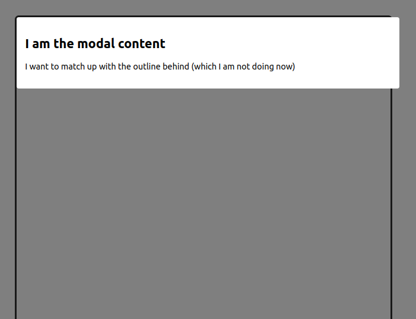
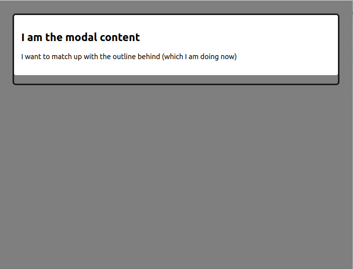

# headless-ui-dialog-centering reproduction [(view live)](https://domdomegg.github.io/headless-ui-dialog-centering/)

| With scrollbar | Without scrollbar |
| - | - |
|  |  |

See https://github.com/tailwindlabs/headlessui/issues/839
